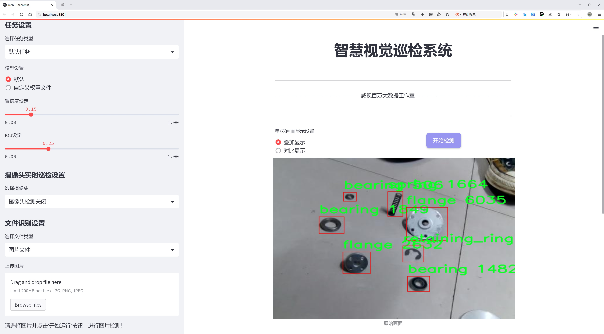

# 机械零件检测检测系统源码分享
 # [一条龙教学YOLOV8标注好的数据集一键训练_70+全套改进创新点发刊_Web前端展示]

### 1.研究背景与意义

项目参考[AAAI Association for the Advancement of Artificial Intelligence](https://gitee.com/qunmasj/projects)

项目来源[AACV Association for the Advancement of Computer Vision](https://kdocs.cn/l/cszuIiCKVNis)

研究背景与意义

随着工业自动化和智能制造的快速发展，机械零件的检测与识别在生产过程中变得愈发重要。传统的人工检测方法不仅效率低下，而且容易受到人为因素的影响，导致检测结果的不稳定性和不准确性。因此，开发高效、准确的机械零件检测系统成为了行业亟待解决的问题。近年来，深度学习技术的迅猛发展为目标检测任务提供了新的解决方案，其中YOLO（You Only Look Once）系列模型因其高效性和实时性受到广泛关注。特别是YOLOv8模型的推出，进一步提升了目标检测的精度和速度，使其在工业应用中展现出良好的前景。

本研究旨在基于改进的YOLOv8模型，构建一个高效的机械零件检测系统。我们所使用的数据集“0428parts”包含3711张图像，涵盖了10个类别的机械零件，包括轴承、螺栓、法兰、齿轮、螺母、保持环、弹簧和垫圈等。这些类别在机械制造和装配过程中具有重要的应用价值。通过对这些零件的准确检测与识别，可以有效提高生产线的自动化水平，降低人工成本，并提升产品质量。

在现有的目标检测技术中，YOLO系列模型因其快速的推理速度和较高的检测精度，成为了许多实时应用的首选。然而，针对特定领域的应用，模型的性能往往受到数据集的影响。为此，本研究将对YOLOv8模型进行改进，以适应机械零件检测的特殊需求。通过数据增强、模型结构优化以及超参数调整等手段，我们期望提升模型在复杂背景下的检测能力，尤其是在机械零件尺寸、形状和颜色多样化的情况下，确保系统能够在不同的环境中稳定运行。

此外，机械零件的检测不仅仅是识别问题，更涉及到对零件质量的评估。通过引入深度学习技术，我们可以实现对零件缺陷的自动检测，从而提高生产过程中的质量控制水平。这一研究不仅具有重要的理论意义，也为实际生产提供了可行的解决方案。通过构建高效的机械零件检测系统，我们可以推动智能制造的发展，提升企业的竞争力。

综上所述，基于改进YOLOv8的机械零件检测系统的研究，不仅填补了当前工业自动化领域在目标检测技术应用方面的空白，同时也为后续的研究提供了重要的参考价值。通过本研究的实施，我们期望能够为机械制造行业的智能化转型贡献一份力量，推动相关技术的进步与应用。

### 2.图片演示





##### 注意：由于此博客编辑较早，上面“2.图片演示”和“3.视频演示”展示的系统图片或者视频可能为老版本，新版本在老版本的基础上升级如下：（实际效果以升级的新版本为准）

  （1）适配了YOLOV8的“目标检测”模型和“实例分割”模型，通过加载相应的权重（.pt）文件即可自适应加载模型。

  （2）支持“图片识别”、“视频识别”、“摄像头实时识别”三种识别模式。

  （3）支持“图片识别”、“视频识别”、“摄像头实时识别”三种识别结果保存导出，解决手动导出（容易卡顿出现爆内存）存在的问题，识别完自动保存结果并导出到tempDir中。

  （4）支持Web前端系统中的标题、背景图等自定义修改，后面提供修改教程。

  另外本项目提供训练的数据集和训练教程,暂不提供权重文件（best.pt）,需要您按照教程进行训练后实现图片演示和Web前端界面演示的效果。

### 3.视频演示

[3.1 视频演示](https://www.bilibili.com/video/BV1CbxvecEQL/)

### 4.数据集信息展示

##### 4.1 本项目数据集详细数据（类别数＆类别名）

nc: 9
names: ['-1', 'bearing', 'bolt', 'flange', 'gear', 'nut', 'retaining_ring', 'spring', 'washer']


##### 4.2 本项目数据集信息介绍

数据集信息展示

在现代制造业和自动化领域，机械零件的检测与识别扮演着至关重要的角色。为了提高机械零件检测系统的准确性和效率，我们构建了一个名为“0428parts”的数据集，专门用于训练和改进YOLOv8模型。该数据集涵盖了九种不同类型的机械零件，旨在为研究人员和工程师提供一个高质量的训练基础，以实现更为精准的零件识别和分类。

“0428parts”数据集的类别数量为9，具体类别包括：-1（用于标识未分类或背景区域）、bearing（轴承）、bolt（螺栓）、flange（法兰）、gear（齿轮）、nut（螺母）、retaining_ring（卡环）、spring（弹簧）和washer（垫圈）。这些类别涵盖了机械零件中常见的组成部分，能够有效地反映出工业生产中的多样性和复杂性。每一种类别的零件都有其独特的形状、尺寸和功能，因而在检测和识别过程中，模型需要具备良好的泛化能力和特征提取能力。

在数据集的构建过程中，我们采取了严格的标准，以确保数据的多样性和代表性。每种类别的样本均来源于实际的工业环境，经过精心挑选和标注，确保每个零件的特征都能被准确捕捉。数据集中包含了不同角度、不同光照条件下的零件图像，这样的多样性不仅增强了模型的鲁棒性，也为后续的训练提供了丰富的样本基础。

为了进一步提升YOLOv8在机械零件检测中的表现，我们在数据集的标注过程中采用了高精度的边界框标注技术。每个零件的边界框均经过多次校验，以确保其位置和尺寸的准确性。这种精细化的标注方式使得模型在训练时能够更好地学习到各个零件的特征，进而提高检测的准确率。

此外，数据集还包含了丰富的背景信息，以模拟真实的工业环境。这种背景的多样性有助于模型学习如何在复杂的场景中进行有效的零件识别，避免因背景干扰而导致的误检或漏检现象。通过这种方式，我们希望能够提升模型在实际应用中的表现，使其能够在各种工作环境中都能保持高效的检测能力。

总之，“0428parts”数据集的构建旨在为机械零件检测系统的研究和应用提供强有力的支持。通过高质量的样本和精确的标注，我们期待该数据集能够为YOLOv8模型的训练带来显著的提升，推动机械零件检测技术的进步，最终实现更高效的工业自动化和智能制造。


### 5.全套项目环境部署视频教程（零基础手把手教学）

[5.1 环境部署教程链接（零基础手把手教学）](https://www.ixigua.com/7404473917358506534?logTag=c807d0cbc21c0ef59de5)


[5.2 安装Python虚拟环境创建和依赖库安装视频教程链接（零基础手把手教学）](https://www.ixigua.com/7404474678003106304?logTag=1f1041108cd1f708b01a)

### 6.手把手YOLOV8训练视频教程（零基础小白有手就能学会）

[6.1 手把手YOLOV8训练视频教程（零基础小白有手就能学会）](https://www.ixigua.com/7404477157818401292?logTag=d31a2dfd1983c9668658)

### 7.70+种全套YOLOV8创新点代码加载调参视频教程（一键加载写好的改进模型的配置文件）

[7.1 70+种全套YOLOV8创新点代码加载调参视频教程（一键加载写好的改进模型的配置文件）](https://www.ixigua.com/7404478314661806627?logTag=29066f8288e3f4eea3a4)

### 8.70+种全套YOLOV8创新点原理讲解（非科班也可以轻松写刊发刊，V10版本正在科研待更新）

由于篇幅限制，每个创新点的具体原理讲解就不一一展开，具体见下列网址中的创新点对应子项目的技术原理博客网址【Blog】：


[8.1 70+种全套YOLOV8创新点原理讲解链接](https://gitee.com/qunmasj/good)

### 9.系统功能展示（检测对象为举例，实际内容以本项目数据集为准）

图9.1.系统支持检测结果表格显示

  图9.2.系统支持置信度和IOU阈值手动调节

  图9.3.系统支持自定义加载权重文件best.pt(需要你通过步骤5中训练获得)

  图9.4.系统支持摄像头实时识别

  图9.5.系统支持图片识别

  图9.6.系统支持视频识别

  图9.7.系统支持识别结果文件自动保存

  图9.8.系统支持Excel导出检测结果数据


### 10.原始YOLOV8算法原理

原始YOLOv8算法原理

YOLOv8算法是由Glenn-Jocher提出的最新版本，继承了YOLO系列算法的优良传统，尤其是YOLOv3和YOLOv5的设计理念。YOLOv8在多个方面进行了创新和改进，使其在目标检测领域表现出色。其设计理念旨在提高检测精度和速度，满足现代计算机视觉应用的需求。

首先，YOLOv8在数据预处理方面延续了YOLOv5的策略，采用了多种数据增强技术以提高模型的泛化能力。这些增强手段包括马赛克增强（Mosaic）、混合增强（Mixup）、空间扰动（Random Perspective）和颜色扰动（HSV Augment）。通过这些技术，YOLOv8能够生成多样化的训练样本，从而使模型在面对不同环境和条件时，依然能够保持良好的检测性能。

在骨干网络结构方面，YOLOv8对YOLOv5的设计进行了进一步优化。YOLOv5的主干网络采用了清晰的层次结构，通过每一层步长为2的3×3卷积来降采样特征图，并接入C3模块以增强特征提取能力。YOLOv8则将C3模块替换为新的C2f模块，这一模块通过引入更多的分支，丰富了梯度回传时的支流，进而提高了网络的学习能力和特征表达能力。C2f模块的设计使得特征流动更加高效，能够更好地捕捉到图像中的细节信息。

YOLOv8在特征融合方面仍然采用了FPN（特征金字塔网络）和PAN（路径聚合网络）的结构，以实现多尺度信息的充分融合。FPN和PAN的结合使得网络能够在不同层次上有效地整合语义信息和定位信息，从而提高对不同尺度目标的检测能力。尽管C3模块被替换为C2f模块，YOLOv8的FPN-PAN结构在整体上与YOLOv5保持一致，确保了其在特征融合方面的优势。

在检测头的设计上，YOLOv8引入了解耦头（Decoupled Head）的结构，区别于之前版本的耦合头（Coupled Head）。这种解耦结构通过将分类和定位任务分为两条并行的分支，分别提取类别特征和位置特征，最终通过1×1卷积完成分类和定位。这种设计不仅提高了模型的灵活性，还加速了模型的收敛过程，使得YOLOv8在实际应用中能够更快地进行目标检测。

标签分配策略是YOLOv8的另一项重要改进。尽管YOLOv5在候选框聚类方面做了很多工作，但其依赖于数据集的特性，可能导致在数据不足时无法准确反映物体的真实分布。YOLOv8摒弃了传统的候选框策略，采用了与YOLOv6相同的TOOD（Task-Oriented Object Detection）动态标签分配策略。这一策略通过使用目标框和目标分数，简化了标签分配的过程，避免了候选框与真实物体尺寸比例不匹配的问题。YOLOv8的损失函数主要由类别损失和位置损失组成，其中类别损失采用了VFL（Varifocal Loss），而回归损失则结合了CIoU（Complete Intersection over Union）和DFL（Distributive Focal Loss）两种形式。这种设计使得YOLOv8在处理正负样本时，能够更加灵活地调整损失权重，从而提高模型的训练效果。

YOLOv8还推出了轻量化版本YOLOv8n，旨在在保持高性能的同时减少模型的计算量。YOLOv8n通过在骨干特征提取网络中使用更轻量化的C2f模块，减少了卷积层的复杂度，并在特征融合层减少了降采样层。轻量化的解耦头替代了传统的耦合头，使得YOLOv8n在处理速度和内存占用上有了显著的提升，适合在资源受限的环境中进行目标检测。

总的来说，YOLOv8算法在多个方面进行了深入的优化和创新，包括数据预处理、骨干网络结构、特征融合、检测头设计以及标签分配策略等。这些改进使得YOLOv8在目标检测任务中具备了更高的精度和更快的速度，充分满足了现代计算机视觉应用的需求。通过不断的技术迭代，YOLOv8不仅继承了前辈算法的优点，更在此基础上开辟了新的发展方向，为目标检测领域带来了新的机遇与挑战。


### 11.项目核心源码讲解（再也不用担心看不懂代码逻辑）

#### 11.1 code\ultralytics\data\explorer\explorer.py

以下是经过精简和注释的核心代码部分，保留了主要功能并添加了详细的中文注释：

```python
# 导入必要的库
from io import BytesIO
from pathlib import Path
from typing import Any, List, Tuple, Union
import cv2
import numpy as np
import torch
from PIL import Image
from tqdm import tqdm
from ultralytics.data.dataset import YOLODataset
from ultralytics.models.yolo.model import YOLO
from ultralytics.utils import LOGGER, IterableSimpleNamespace, checks

class ExplorerDataset(YOLODataset):
    def __init__(self, *args, data: dict = None, **kwargs) -> None:
        # 初始化数据集，调用父类构造函数
        super().__init__(*args, data=data, **kwargs)

    def load_image(self, i: int) -> Union[Tuple[np.ndarray, Tuple[int, int], Tuple[int, int]], Tuple[None, None, None]]:
        """从数据集中加载一张图像，不进行任何缩放操作。"""
        im, f, fn = self.ims[i], self.im_files[i], self.npy_files[i]
        if im is None:  # 如果图像未缓存
            if fn.exists():  # 如果存在npy文件，则加载
                im = np.load(fn)
            else:  # 否则读取图像
                im = cv2.imread(f)  # 读取BGR格式图像
                if im is None:
                    raise FileNotFoundError(f"图像未找到 {f}")
            h0, w0 = im.shape[:2]  # 获取原始高度和宽度
            return im, (h0, w0), im.shape[:2]

        return self.ims[i], self.im_hw0[i], self.im_hw[i]

class Explorer:
    def __init__(self, data: Union[str, Path] = "coco128.yaml", model: str = "yolov8n.pt", uri: str = "~/ultralytics/explorer") -> None:
        # 检查依赖项
        checks.check_requirements(["lancedb>=0.4.3", "duckdb"])
        import lancedb

        # 连接到LanceDB数据库
        self.connection = lancedb.connect(uri)
        self.table_name = Path(data).name.lower() + "_" + model.lower()  # 表名
        self.model = YOLO(model)  # 加载YOLO模型
        self.data = data  # 数据集路径
        self.table = None  # 数据表初始化为空
        self.progress = 0  # 进度初始化为0

    def create_embeddings_table(self, force: bool = False, split: str = "train") -> None:
        """创建包含数据集中图像嵌入的LanceDB表。"""
        if self.table is not None and not force:
            LOGGER.info("表已存在，重用它。")
            return
        if self.table_name in self.connection.table_names() and not force:
            LOGGER.info(f"表 {self.table_name} 已存在，重用它。")
            self.table = self.connection.open_table(self.table_name)
            self.progress = 1
            return
        if self.data is None:
            raise ValueError("必须提供数据以创建嵌入表")

        # 检查数据集信息
        data_info = check_det_dataset(self.data)
        if split not in data_info:
            raise ValueError(f"数据集中未找到分割 {split}。可用的键为 {list(data_info.keys())}")

        choice_set = data_info[split]
        choice_set = choice_set if isinstance(choice_set, list) else [choice_set]
        dataset = ExplorerDataset(img_path=choice_set, data=data_info, augment=False, cache=False, task=self.model.task)

        # 创建表的模式
        batch = dataset[0]
        vector_size = self.model.embed(batch["im_file"], verbose=False)[0].shape[0]
        table = self.connection.create_table(self.table_name, schema=get_table_schema(vector_size), mode="overwrite")
        table.add(self._yield_batches(dataset, data_info, self.model))

        self.table = table

    def _yield_batches(self, dataset: ExplorerDataset, data_info: dict, model: YOLO):
        """生成数据批次以进行嵌入。"""
        for i in tqdm(range(len(dataset))):
            self.progress = float(i + 1) / len(dataset)
            batch = dataset[i]
            batch["vector"] = model.embed(batch["im_file"], verbose=False)[0].detach().tolist()  # 计算嵌入向量
            yield [batch]

    def query(self, imgs: Union[str, np.ndarray, List[str], List[np.ndarray]] = None, limit: int = 25) -> Any:
        """查询表以获取相似图像。"""
        if self.table is None:
            raise ValueError("表未创建，请先创建表。")
        if isinstance(imgs, str):
            imgs = [imgs]
        embeds = self.model.embed(imgs)
        embeds = torch.mean(torch.stack(embeds), 0).cpu().numpy() if len(embeds) > 1 else embeds[0].cpu().numpy()
        return self.table.search(embeds).limit(limit).to_arrow()  # 返回查询结果

    def plot_similar(self, img: Union[str, np.ndarray, List[str], List[np.ndarray]] = None, limit: int = 25) -> Image.Image:
        """绘制相似图像。"""
        similar = self.query(img, limit=limit)
        if len(similar) == 0:
            LOGGER.info("未找到结果。")
            return None
        img = plot_query_result(similar)  # 绘制查询结果
        return Image.fromarray(img)

# 其他方法和功能可以根据需要添加
```

### 代码说明：
1. **ExplorerDataset** 类负责加载图像数据，支持从缓存或文件中读取图像。
2. **Explorer** 类是主要的操作类，负责创建嵌入表、查询相似图像、绘制结果等。
3. **create_embeddings_table** 方法用于创建和填充嵌入表。
4. **query** 方法用于根据输入图像查询相似图像。
5. **plot_similar** 方法用于可视化查询结果。

以上代码保留了核心功能，并添加了详细的中文注释，以便更好地理解代码的逻辑和用途。

这个文件是一个用于图像数据集探索和查询的Python类，主要用于与Ultralytics YOLO模型结合使用。文件中的主要类是`Explorer`，它负责创建图像嵌入表、查询相似图像、执行SQL查询、计算相似性索引等功能。

首先，`ExplorerDataset`类继承自`YOLODataset`，用于加载图像数据集。它实现了`load_image`方法，该方法根据索引加载图像，支持从内存或文件系统中读取图像数据，并返回图像及其原始尺寸。`build_transforms`方法则用于创建图像的转换操作，主要是格式化而不进行尺寸调整。

`Explorer`类的构造函数接受数据集路径、模型路径和数据库URI等参数，并进行一些基本的检查。它使用LanceDB来存储图像的嵌入信息，并根据提供的数据集和模型创建一个表。`create_embeddings_table`方法用于创建或重用存储图像嵌入的数据库表，确保如果表已经存在则不会重复创建。

在`_yield_batches`方法中，类会生成数据批次并计算图像的嵌入向量。`query`方法允许用户查询相似图像，支持单个图像或图像列表，并返回相似图像的结果。`sql_query`方法则允许用户使用SQL风格的查询来检索数据，支持返回Pandas DataFrame或Arrow表格。

此外，`plot_sql_query`和`plot_similar`方法用于可视化查询结果，返回生成的图像。`similarity_index`方法计算所有图像的相似性索引，返回一个包含相似图像及其距离的DataFrame。`plot_similarity_index`方法则用于绘制相似性索引的图形。

`ask_ai`方法允许用户通过自然语言查询图像，利用AI生成SQL查询并返回结果。`visualize`和`generate_report`方法目前是占位符，尚未实现。

总的来说，这个文件提供了一整套工具，用于加载图像数据集、计算图像嵌入、查询相似图像以及可视化和分析数据，适合于使用YOLO模型进行图像处理和分析的场景。

#### 11.2 code\ultralytics\models\yolo\detect\predict.py

以下是经过简化和注释的核心代码部分：

```python
# 导入必要的模块
from ultralytics.engine.predictor import BasePredictor
from ultralytics.engine.results import Results
from ultralytics.utils import ops

class DetectionPredictor(BasePredictor):
    """
    扩展自 BasePredictor 类的检测模型预测类。
    """

    def postprocess(self, preds, img, orig_imgs):
        """
        对预测结果进行后处理，并返回结果对象列表。

        参数:
        preds: 模型的预测结果
        img: 输入图像
        orig_imgs: 原始输入图像（可能是一个批次）

        返回:
        results: 包含处理后结果的 Results 对象列表
        """
        # 应用非极大值抑制（NMS）来过滤重叠的检测框
        preds = ops.non_max_suppression(
            preds,
            self.args.conf,  # 置信度阈值
            self.args.iou,    # IOU 阈值
            agnostic=self.args.agnostic_nms,  # 是否类别无关的 NMS
            max_det=self.args.max_det,  # 最大检测框数量
            classes=self.args.classes,   # 过滤的类别
        )

        # 如果输入的原始图像不是列表，则将其转换为 numpy 数组
        if not isinstance(orig_imgs, list):
            orig_imgs = ops.convert_torch2numpy_batch(orig_imgs)

        results = []  # 初始化结果列表
        for i, pred in enumerate(preds):
            orig_img = orig_imgs[i]  # 获取对应的原始图像
            # 将预测框的坐标缩放到原始图像的尺寸
            pred[:, :4] = ops.scale_boxes(img.shape[2:], pred[:, :4], orig_img.shape)
            img_path = self.batch[0][i]  # 获取图像路径
            # 创建 Results 对象并添加到结果列表
            results.append(Results(orig_img, path=img_path, names=self.model.names, boxes=pred))
        
        return results  # 返回处理后的结果列表
```

### 代码说明：
1. **类定义**：`DetectionPredictor` 继承自 `BasePredictor`，用于处理检测模型的预测。
2. **后处理方法**：`postprocess` 方法对模型的预测结果进行后处理，主要包括非极大值抑制（NMS）和坐标缩放。
3. **非极大值抑制**：通过 `ops.non_max_suppression` 函数过滤掉重叠的检测框，以提高检测的准确性。
4. **图像处理**：将输入的原始图像转换为 numpy 数组格式，以便后续处理。
5. **结果生成**：将处理后的预测框与原始图像结合，创建 `Results` 对象，并将其添加到结果列表中，最终返回该列表。

这个程序文件定义了一个名为 `DetectionPredictor` 的类，它继承自 `BasePredictor` 类，主要用于基于检测模型进行预测。文件开头包含了版权信息，表明该代码遵循 AGPL-3.0 许可证。

在类的文档字符串中，提供了一个使用示例，展示了如何导入 `DetectionPredictor` 类并创建一个预测器实例。示例中使用了一个名为 `yolov8n.pt` 的模型和一个数据源 `ASSETS`，然后调用 `predict_cli()` 方法进行预测。

类中定义了一个名为 `postprocess` 的方法，该方法用于对模型的预测结果进行后处理。具体来说，首先调用 `ops.non_max_suppression` 函数对预测结果进行非极大值抑制，以过滤掉冗余的检测框。这个过程使用了一些参数，如置信度阈值、IOU阈值、是否使用类别无关的 NMS、最大检测框数量以及指定的类别。

接下来，方法检查输入的原始图像是否为列表格式。如果不是，则将其转换为 NumPy 数组格式，以便后续处理。然后，方法会遍历每个预测结果，并对每个预测框进行坐标缩放，以适应原始图像的尺寸。每个预测结果和对应的原始图像路径被封装成 `Results` 对象，并添加到结果列表中。

最后，`postprocess` 方法返回一个包含所有结果的列表，这些结果包括原始图像、图像路径、模型名称和检测框信息。这个类的设计使得用户能够方便地对 YOLO 模型的检测结果进行处理和使用。

#### 11.3 ui.py

以下是保留的核心代码部分，并附上详细的中文注释：

```python
import sys
import subprocess

def run_script(script_path):
    """
    使用当前 Python 环境运行指定的脚本。

    Args:
        script_path (str): 要运行的脚本路径

    Returns:
        None
    """
    # 获取当前 Python 解释器的路径
    python_path = sys.executable

    # 构建运行命令，使用 streamlit 运行指定的脚本
    command = f'"{python_path}" -m streamlit run "{script_path}"'

    # 执行命令
    result = subprocess.run(command, shell=True)
    # 检查命令执行结果，如果返回码不为0，表示出错
    if result.returncode != 0:
        print("脚本运行出错。")

# 实例化并运行应用
if __name__ == "__main__":
    # 指定要运行的脚本路径
    script_path = "web.py"  # 假设脚本在当前目录下

    # 调用函数运行脚本
    run_script(script_path)
```

### 代码注释说明：
1. **导入模块**：
   - `sys`：用于获取当前 Python 解释器的路径。
   - `subprocess`：用于执行外部命令。

2. **`run_script` 函数**：
   - 该函数接受一个参数 `script_path`，表示要运行的 Python 脚本的路径。
   - 使用 `sys.executable` 获取当前 Python 解释器的路径。
   - 构建一个命令字符串，用于通过 `streamlit` 运行指定的脚本。
   - 使用 `subprocess.run` 执行构建的命令，并检查返回值。如果返回值不为0，表示脚本运行出错，打印错误信息。

3. **主程序块**：
   - 在 `if __name__ == "__main__":` 块中，指定要运行的脚本路径（这里假设脚本名为 `web.py`）。
   - 调用 `run_script` 函数，传入脚本路径以执行该脚本。

这个程序文件名为 `ui.py`，其主要功能是通过当前的 Python 环境来运行一个指定的脚本。程序的实现依赖于几个标准库，包括 `sys`、`os` 和 `subprocess`，以及一个自定义模块 `QtFusion.path` 中的 `abs_path` 函数。

在程序的开头，首先导入了所需的模块。`sys` 模块用于访问与 Python 解释器相关的变量和函数，`os` 模块提供了与操作系统交互的功能，而 `subprocess` 模块则用于创建新进程、连接到它们的输入/输出/错误管道，并获取它们的返回码。

接下来，定义了一个名为 `run_script` 的函数，该函数接受一个参数 `script_path`，表示要运行的脚本的路径。在函数内部，首先通过 `sys.executable` 获取当前 Python 解释器的路径。然后，构建一个命令字符串，使用 `streamlit` 模块来运行指定的脚本。这个命令的格式是 `"{python_path}" -m streamlit run "{script_path}"`，其中 `python_path` 是当前 Python 解释器的路径，`script_path` 是要运行的脚本路径。

随后，使用 `subprocess.run` 方法执行构建好的命令。如果脚本运行过程中出现错误，返回码将不为零，程序会打印出“脚本运行出错”的提示信息。

在文件的最后部分，使用 `if __name__ == "__main__":` 来判断当前模块是否是主程序。如果是，则指定要运行的脚本路径为 `web.py`，并调用 `run_script` 函数来执行该脚本。这里的 `abs_path` 函数用于获取 `web.py` 的绝对路径，确保脚本可以在任何工作目录下正确找到。

总体而言，这个程序的主要目的是简化通过 Python 环境运行 Streamlit 应用的过程，提供了一种方便的方式来启动指定的脚本。

#### 11.4 70+种YOLOv8算法改进源码大全和调试加载训练教程（非必要）\ultralytics\utils\callbacks\tensorboard.py

以下是代码中最核心的部分，并附上详细的中文注释：

```python
# 导入必要的库
from ultralytics.utils import LOGGER, SETTINGS, TESTS_RUNNING, colorstr

try:
    # 尝试导入TensorBoard的SummaryWriter
    from torch.utils.tensorboard import SummaryWriter

    # 确保当前不是在测试环境中
    assert not TESTS_RUNNING  
    # 确保TensorBoard集成已启用
    assert SETTINGS['tensorboard'] is True  
    WRITER = None  # 初始化TensorBoard的SummaryWriter实例

except (ImportError, AssertionError, TypeError):
    # 捕获导入错误、断言错误和类型错误（Windows中的protobuf错误）
    SummaryWriter = None  # 如果导入失败，则将SummaryWriter设置为None


def _log_scalars(scalars, step=0):
    """将标量值记录到TensorBoard中。"""
    if WRITER:  # 如果WRITER实例存在
        for k, v in scalars.items():  # 遍历标量字典
            WRITER.add_scalar(k, v, step)  # 记录每个标量


def _log_tensorboard_graph(trainer):
    """将模型图记录到TensorBoard中。"""
    try:
        import warnings
        from ultralytics.utils.torch_utils import de_parallel, torch

        imgsz = trainer.args.imgsz  # 获取输入图像大小
        imgsz = (imgsz, imgsz) if isinstance(imgsz, int) else imgsz  # 确保图像大小为元组
        p = next(trainer.model.parameters())  # 获取模型参数以确定设备和类型
        im = torch.zeros((1, 3, *imgsz), device=p.device, dtype=p.dtype)  # 创建一个零输入图像
        with warnings.catch_warnings():
            warnings.simplefilter('ignore', category=UserWarning)  # 忽略JIT跟踪警告
            WRITER.add_graph(torch.jit.trace(de_parallel(trainer.model), im, strict=False), [])  # 记录模型图
    except Exception as e:
        LOGGER.warning(f'WARNING ⚠️ TensorBoard图形可视化失败 {e}')  # 记录警告信息


def on_pretrain_routine_start(trainer):
    """使用SummaryWriter初始化TensorBoard日志记录。"""
    if SummaryWriter:  # 如果SummaryWriter可用
        try:
            global WRITER  # 声明WRITER为全局变量
            WRITER = SummaryWriter(str(trainer.save_dir))  # 创建SummaryWriter实例
            prefix = colorstr('TensorBoard: ')  # 定义前缀颜色
            LOGGER.info(f"{prefix}Start with 'tensorboard --logdir {trainer.save_dir}', view at http://localhost:6006/")  # 记录启动信息
        except Exception as e:
            LOGGER.warning(f'WARNING ⚠️ TensorBoard未正确初始化，未记录此运行。 {e}')  # 记录初始化失败的警告


def on_train_start(trainer):
    """记录TensorBoard图形。"""
    if WRITER:  # 如果WRITER实例存在
        _log_tensorboard_graph(trainer)  # 调用记录图形的函数


def on_batch_end(trainer):
    """在训练批次结束时记录标量统计信息。"""
    _log_scalars(trainer.label_loss_items(trainer.tloss, prefix='train'), trainer.epoch + 1)  # 记录训练损失


def on_fit_epoch_end(trainer):
    """在训练周期结束时记录周期指标。"""
    _log_scalars(trainer.metrics, trainer.epoch + 1)  # 记录周期指标


# 定义回调函数字典，根据SummaryWriter是否可用来决定是否创建
callbacks = {
    'on_pretrain_routine_start': on_pretrain_routine_start,
    'on_train_start': on_train_start,
    'on_fit_epoch_end': on_fit_epoch_end,
    'on_batch_end': on_batch_end} if SummaryWriter else {}
```

### 代码说明：
1. **导入库**：导入必要的库和模块，包括TensorBoard的`SummaryWriter`。
2. **异常处理**：在导入`SummaryWriter`时，处理可能出现的错误，确保在不支持的环境中不会崩溃。
3. **日志记录函数**：
   - `_log_scalars`：将标量数据记录到TensorBoard。
   - `_log_tensorboard_graph`：记录模型的计算图。
4. **回调函数**：定义了多个回调函数，在训练的不同阶段（如开始训练、每个批次结束、每个周期结束）进行日志记录。
5. **回调字典**：根据`SummaryWriter`的可用性创建回调字典，便于在训练过程中调用相应的日志记录函数。

这个程序文件是一个用于集成TensorBoard的回调模块，主要用于在Ultralytics YOLO（You Only Look Once）模型训练过程中记录和可视化训练过程中的各种指标。代码中首先导入了一些必要的模块和库，包括Ultralytics的日志记录器和设置，以及TensorBoard的SummaryWriter。

在导入TensorBoard的SummaryWriter时，代码中有一些异常处理，确保在不支持TensorBoard的环境中不会导致程序崩溃。具体来说，如果在导入过程中发生了ImportError、AssertionError或TypeError，SummaryWriter将被设置为None。

接下来，定义了几个主要的函数。`_log_scalars`函数用于将标量值记录到TensorBoard中，它会遍历传入的标量字典并使用SummaryWriter的`add_scalar`方法进行记录。`_log_tensorboard_graph`函数则用于将模型的计算图记录到TensorBoard中，它首先创建一个输入图像的张量，然后使用torch.jit.trace来记录模型的图结构。

在训练的不同阶段，代码定义了一些回调函数。`on_pretrain_routine_start`函数在训练开始前初始化TensorBoard的记录器，并输出如何启动TensorBoard的提示信息。`on_train_start`函数在训练开始时调用，用于记录模型的计算图。`on_batch_end`函数在每个训练批次结束时调用，记录当前批次的损失统计信息。`on_fit_epoch_end`函数在每个训练周期结束时调用，记录当前周期的指标。

最后，所有的回调函数被组织成一个字典，只有在SummaryWriter存在的情况下才会被创建，这样可以避免在不支持TensorBoard的环境中出现错误。这个模块的设计使得在YOLO模型训练过程中，可以方便地记录和可视化训练的进展，帮助开发者更好地理解模型的性能和训练过程。

#### 11.5 code\ultralytics\models\sam\modules\tiny_encoder.py

以下是经过简化并添加详细中文注释的核心代码部分：

```python
import torch
import torch.nn as nn
import torch.nn.functional as F

class Conv2d_BN(torch.nn.Sequential):
    """一个包含2D卷积和批量归一化的顺序容器。"""

    def __init__(self, in_channels, out_channels, kernel_size=1, stride=1, padding=0):
        """初始化卷积层和批量归一化层。"""
        super().__init__()
        # 添加卷积层
        self.add_module("conv", torch.nn.Conv2d(in_channels, out_channels, kernel_size, stride, padding, bias=False))
        # 添加批量归一化层
        self.add_module("bn", torch.nn.BatchNorm2d(out_channels))

class PatchEmbed(nn.Module):
    """将图像嵌入为补丁并投影到指定的嵌入维度。"""

    def __init__(self, in_chans, embed_dim, resolution, activation):
        """初始化补丁嵌入层。"""
        super().__init__()
        self.patches_resolution = (resolution // 4, resolution // 4)  # 计算补丁的分辨率
        self.seq = nn.Sequential(
            Conv2d_BN(in_chans, embed_dim // 2, kernel_size=3, stride=2, padding=1),
            activation(),
            Conv2d_BN(embed_dim // 2, embed_dim, kernel_size=3, stride=2, padding=1),
        )

    def forward(self, x):
        """将输入张量通过补丁嵌入层的序列操作。"""
        return self.seq(x)

class MBConv(nn.Module):
    """移动反向瓶颈卷积层，属于EfficientNet架构。"""

    def __init__(self, in_chans, out_chans, expand_ratio, activation):
        """初始化MBConv层。"""
        super().__init__()
        self.conv1 = Conv2d_BN(in_chans, in_chans * expand_ratio, kernel_size=1)
        self.act1 = activation()
        self.conv2 = Conv2d_BN(in_chans * expand_ratio, in_chans * expand_ratio, kernel_size=3, stride=1, padding=1, groups=in_chans * expand_ratio)
        self.act2 = activation()
        self.conv3 = Conv2d_BN(in_chans * expand_ratio, out_chans, kernel_size=1, bn_weight_init=0.0)
        self.act3 = activation()

    def forward(self, x):
        """实现MBConv层的前向传播。"""
        shortcut = x  # 保存输入以便后续残差连接
        x = self.conv1(x)
        x = self.act1(x)
        x = self.conv2(x)
        x = self.act2(x)
        x = self.conv3(x)
        x += shortcut  # 残差连接
        return self.act3(x)

class TinyViT(nn.Module):
    """TinyViT架构，用于视觉任务。"""

    def __init__(self, img_size=224, in_chans=3, num_classes=1000, embed_dims=[96, 192, 384, 768], depths=[2, 2, 6, 2]):
        """初始化TinyViT模型。"""
        super().__init__()
        self.patch_embed = PatchEmbed(in_chans=in_chans, embed_dim=embed_dims[0], resolution=img_size, activation=nn.GELU)
        self.layers = nn.ModuleList()
        for i_layer in range(len(depths)):
            layer = nn.ModuleList([MBConv(embed_dims[i_layer], embed_dims[i_layer], expand_ratio=4.0, activation=nn.GELU) for _ in range(depths[i_layer])])
            self.layers.append(layer)
        self.head = nn.Linear(embed_dims[-1], num_classes) if num_classes > 0 else nn.Identity()

    def forward(self, x):
        """执行输入张量的前向传播。"""
        x = self.patch_embed(x)  # 将输入图像嵌入为补丁
        for layer in self.layers:
            for block in layer:
                x = block(x)  # 通过每个MBConv块
        return self.head(x)  # 分类头
```

### 代码注释说明：
1. **Conv2d_BN**: 该类实现了一个包含卷积和批量归一化的层，通常用于卷积神经网络中以提高训练稳定性和收敛速度。
2. **PatchEmbed**: 该类将输入图像分割成小补丁，并将其嵌入到一个高维空间中，以便后续处理。
3. **MBConv**: 该类实现了移动反向瓶颈卷积层，使用扩展和深度可分离卷积，适用于高效的模型设计。
4. **TinyViT**: 该类是整个TinyViT模型的核心，包含了补丁嵌入层和多个MBConv层，最终通过线性层进行分类。

这个程序文件实现了一个名为TinyViT的视觉模型架构，主要用于图像分类等计算机视觉任务。TinyViT模型结合了多种现代卷积和自注意力机制，灵活地处理输入图像。文件中包含多个类，每个类实现了模型的不同部分。

首先，文件引入了一些必要的库，包括PyTorch的核心模块和一些实用工具。接着，定义了几个基础组件，例如`Conv2d_BN`类，它是一个顺序容器，执行二维卷积操作并随后进行批归一化。这个类在模型中被广泛使用，以确保每个卷积层的输出经过标准化处理。

`PatchEmbed`类负责将输入图像分割成小块（patches），并将这些小块映射到指定的嵌入维度。它使用了两个卷积层来实现这一功能，分别对输入进行降采样。

`MBConv`类实现了移动反向瓶颈卷积层，这是EfficientNet架构中的一个重要组成部分。该层通过一系列卷积和激活函数来处理输入，并在训练时支持DropPath（随机深度）机制，以提高模型的泛化能力。

`PatchMerging`类则用于合并特征图中的相邻小块，并将其投影到新的维度，进一步减少特征图的空间维度。

`ConvLayer`类由多个MBConv层组成，支持在输出上应用下采样操作，并提供梯度检查点功能以节省内存。

`Mlp`类实现了多层感知机（MLP），用于对输入进行进一步的非线性变换。它包括层归一化和两个全连接层。

`Attention`类实现了多头自注意力机制，支持空间感知。它通过计算查询、键和值的关系来捕捉输入特征之间的依赖关系，并应用可训练的注意力偏置。

`TinyViTBlock`类结合了自注意力和局部卷积，构成TinyViT的基本模块。它首先应用自注意力机制，然后通过局部卷积层处理特征。

`BasicLayer`类是TinyViT的一个基本层，包含多个TinyViTBlock，并可选择性地进行下采样。

`LayerNorm2d`类实现了二维层归一化，用于在特征图中进行归一化处理。

最后，`TinyViT`类是整个模型的核心，负责初始化各个层和组件，并定义前向传播的逻辑。它支持多种配置选项，如输入图像大小、嵌入维度、层数、注意力头数等。模型的前向传播通过`forward_features`方法实现，最终输出经过处理的特征图。

整体而言，这个文件实现了一个高效的视觉模型架构，结合了卷积神经网络和自注意力机制，适用于各种计算机视觉任务。

#### 11.6 train.py

以下是代码中最核心的部分，并附上详细的中文注释：

```python
class DetectionTrainer(BaseTrainer):
    """
    DetectionTrainer类，继承自BaseTrainer类，用于基于检测模型的训练。
    """

    def build_dataset(self, img_path, mode="train", batch=None):
        """
        构建YOLO数据集。

        参数:
            img_path (str): 包含图像的文件夹路径。
            mode (str): 模式，可以是'train'或'val'，用户可以为每种模式自定义不同的数据增强。
            batch (int, optional): 批次大小，仅用于'rect'模式。默认为None。
        """
        gs = max(int(de_parallel(self.model).stride.max() if self.model else 0), 32)
        return build_yolo_dataset(self.args, img_path, batch, self.data, mode=mode, rect=mode == "val", stride=gs)

    def get_dataloader(self, dataset_path, batch_size=16, rank=0, mode="train"):
        """构造并返回数据加载器。"""
        assert mode in ["train", "val"]  # 确保模式是'train'或'val'
        with torch_distributed_zero_first(rank):  # 在分布式训练中，确保数据集只初始化一次
            dataset = self.build_dataset(dataset_path, mode, batch_size)  # 构建数据集
        shuffle = mode == "train"  # 训练模式下打乱数据
        if getattr(dataset, "rect", False) and shuffle:
            LOGGER.warning("WARNING ⚠️ 'rect=True'与DataLoader的shuffle不兼容，设置shuffle=False")
            shuffle = False
        workers = self.args.workers if mode == "train" else self.args.workers * 2  # 设置工作线程数
        return build_dataloader(dataset, batch_size, workers, shuffle, rank)  # 返回数据加载器

    def preprocess_batch(self, batch):
        """对一批图像进行预处理，包括缩放和转换为浮点数。"""
        batch["img"] = batch["img"].to(self.device, non_blocking=True).float() / 255  # 将图像转换为浮点数并归一化
        if self.args.multi_scale:  # 如果启用多尺度
            imgs = batch["img"]
            sz = (
                random.randrange(self.args.imgsz * 0.5, self.args.imgsz * 1.5 + self.stride)
                // self.stride
                * self.stride
            )  # 随机选择一个新的尺寸
            sf = sz / max(imgs.shape[2:])  # 计算缩放因子
            if sf != 1:  # 如果缩放因子不为1
                ns = [
                    math.ceil(x * sf / self.stride) * self.stride for x in imgs.shape[2:]
                ]  # 计算新的形状
                imgs = nn.functional.interpolate(imgs, size=ns, mode="bilinear", align_corners=False)  # 进行插值缩放
            batch["img"] = imgs  # 更新批次中的图像
        return batch

    def get_model(self, cfg=None, weights=None, verbose=True):
        """返回一个YOLO检测模型。"""
        model = DetectionModel(cfg, nc=self.data["nc"], verbose=verbose and RANK == -1)  # 创建检测模型
        if weights:
            model.load(weights)  # 加载权重
        return model

    def get_validator(self):
        """返回用于YOLO模型验证的DetectionValidator。"""
        self.loss_names = "box_loss", "cls_loss", "dfl_loss"  # 定义损失名称
        return yolo.detect.DetectionValidator(
            self.test_loader, save_dir=self.save_dir, args=copy(self.args), _callbacks=self.callbacks
        )  # 返回验证器

    def plot_training_samples(self, batch, ni):
        """绘制带有注释的训练样本。"""
        plot_images(
            images=batch["img"],
            batch_idx=batch["batch_idx"],
            cls=batch["cls"].squeeze(-1),
            bboxes=batch["bboxes"],
            paths=batch["im_file"],
            fname=self.save_dir / f"train_batch{ni}.jpg",
            on_plot=self.on_plot,
        )
```

### 代码核心部分说明：
1. **DetectionTrainer类**：用于训练YOLO检测模型的类，继承自BaseTrainer。
2. **build_dataset方法**：构建YOLO数据集，支持训练和验证模式。
3. **get_dataloader方法**：构造数据加载器，确保在分布式训练中只初始化一次数据集。
4. **preprocess_batch方法**：对输入的图像批次进行预处理，包括归一化和可能的缩放。
5. **get_model方法**：创建并返回YOLO检测模型，可以选择加载预训练权重。
6. **get_validator方法**：返回用于模型验证的验证器。
7. **plot_training_samples方法**：绘制训练样本及其注释，便于可视化训练过程。

这个程序文件 `train.py` 是一个用于训练目标检测模型的代码，主要基于 YOLO（You Only Look Once）架构。它继承自 `BaseTrainer` 类，提供了一系列方法来构建数据集、加载数据、预处理图像、设置模型属性、获取模型、验证模型、记录损失、显示训练进度以及绘制训练样本和指标。

首先，文件导入了一些必要的库和模块，包括数学运算、随机数生成、深度学习框架 PyTorch 的神经网络模块、数据处理和模型构建的工具等。接着，定义了 `DetectionTrainer` 类，这个类的主要功能是训练基于 YOLO 的目标检测模型。

在 `build_dataset` 方法中，程序根据给定的图像路径和模式（训练或验证）构建 YOLO 数据集。它使用 `build_yolo_dataset` 函数来创建数据集，并根据模型的步幅设置合适的参数。

`get_dataloader` 方法用于构建数据加载器。它会根据模式选择是否打乱数据，并设置工作线程的数量。通过调用 `build_dataloader` 函数，返回一个可迭代的数据加载器。

`preprocess_batch` 方法负责对输入的图像批次进行预处理，包括将图像缩放到合适的大小并转换为浮点数格式。该方法还支持多尺度训练，通过随机选择图像大小来增强模型的鲁棒性。

`set_model_attributes` 方法用于设置模型的属性，包括类别数量和类别名称。这些信息会被附加到模型中，以便在训练过程中使用。

`get_model` 方法返回一个 YOLO 检测模型，可以选择加载预训练的权重。`get_validator` 方法则返回一个用于验证模型性能的验证器。

`label_loss_items` 方法用于返回一个包含训练损失项的字典，方便记录和分析训练过程中的损失情况。

`progress_string` 方法生成一个格式化的字符串，用于显示训练进度，包括当前的轮次、GPU 内存使用情况、损失值、实例数量和图像大小等信息。

`plot_training_samples` 方法用于绘制训练样本及其标注，帮助可视化训练数据的质量。`plot_metrics` 和 `plot_training_labels` 方法则分别用于绘制训练过程中的指标和标注，便于分析模型的训练效果。

总的来说，这个文件提供了一个完整的框架，用于训练 YOLO 目标检测模型，涵盖了数据处理、模型构建、训练过程监控和结果可视化等多个方面。

### 12.系统整体结构（节选）

### 整体功能和架构概括

该项目是一个基于YOLO（You Only Look Once）架构的目标检测系统，旨在提供一个灵活且高效的框架，用于训练、预测和评估目标检测模型。项目包含多个模块，涵盖数据处理、模型构建、训练过程监控、可视化和推理等功能。整体架构分为以下几个部分：

1. **数据处理**：负责加载和预处理图像数据集，为模型训练和验证提供合适的输入。
2. **模型构建**：实现YOLO模型及其变体的架构，包括主干网络、头部模块和其他组件。
3. **训练和验证**：提供训练循环、损失计算、模型验证和结果记录的功能。
4. **可视化**：通过TensorBoard等工具记录训练过程中的指标和样本，帮助开发者分析模型性能。
5. **推理**：实现模型的推理功能，能够对新图像进行目标检测。

### 文件功能整理表

| 文件路径                                                                                              | 功能描述                                                         |
|-----------------------------------------------------------------------------------------------------|----------------------------------------------------------------|
| `code\ultralytics\data\explorer\explorer.py`                                                       | 提供图像数据集的探索和查询功能，包括相似图像检索和SQL查询。       |
| `code\ultralytics\models\yolo\detect\predict.py`                                                  | 实现YOLO模型的预测功能，包括后处理和相似图像查询。               |
| `ui.py`                                                                                             | 提供一个命令行界面，用于运行指定的Streamlit脚本。                 |
| `70+种YOLOv8算法改进源码大全和调试加载训练教程（非必要）\ultralytics\utils\callbacks\tensorboard.py` | 集成TensorBoard，记录和可视化训练过程中的指标和损失。             |
| `code\ultralytics\models\sam\modules\tiny_encoder.py`                                              | 实现TinyViT模型架构，结合卷积和自注意力机制用于图像处理。         |
| `train.py`                                                                                          | 提供YOLO模型的训练框架，包括数据加载、模型构建和训练过程监控。   |
| `70+种YOLOv8算法改进源码大全和调试加载训练教程（非必要）\ultralytics\nn\backbone\convnextv2.py`   | 实现ConvNeXt V2模型的构建，用于特征提取。                        |
| `code\ultralytics\nn\modules\head.py`                                                              | 定义YOLO模型的头部模块，负责生成最终的检测输出。                  |
| `70+种YOLOv8算法改进源码大全和调试加载训练教程（非必要）\ultralytics\nn\extra_modules\ops_dcnv3\setup.py` | 设置和安装DCNv3模块，扩展YOLO模型的功能。                        |
| `70+种YOLOv8算法改进源码大全和调试加载训练教程（非必要）\ultralytics\nn\backbone\repvit.py`      | 实现RepViT模型架构，结合卷积和自注意力机制用于图像处理。         |
| `code\ultralytics\models\yolo\detect\train.py`                                                    | 训练YOLO模型的实现，包含训练循环和损失计算。                      |
| `70+种YOLOv8算法改进源码大全和调试加载训练教程（非必要）\ultralytics\utils\errors.py`            | 定义错误处理和异常类，增强代码的健壮性。                          |
| `70+种YOLOv8算法改进源码大全和调试加载训练教程（非必要）\ultralytics\utils\files.py`            | 提供文件操作的工具函数，如文件路径处理和文件读写。                |

这个表格概述了每个文件的主要功能，帮助理解项目的整体结构和各个模块之间的关系。

注意：由于此博客编辑较早，上面“11.项目核心源码讲解（再也不用担心看不懂代码逻辑）”中部分代码可能会优化升级，仅供参考学习，完整“训练源码”、“Web前端界面”和“70+种创新点源码”以“13.完整训练+Web前端界面+70+种创新点源码、数据集获取”的内容为准。

### 13.完整训练+Web前端界面+70+种创新点源码、数据集获取


# [下载链接：https://mbd.pub/o/bread/ZpyUkptr](https://mbd.pub/o/bread/ZpyUkptr)